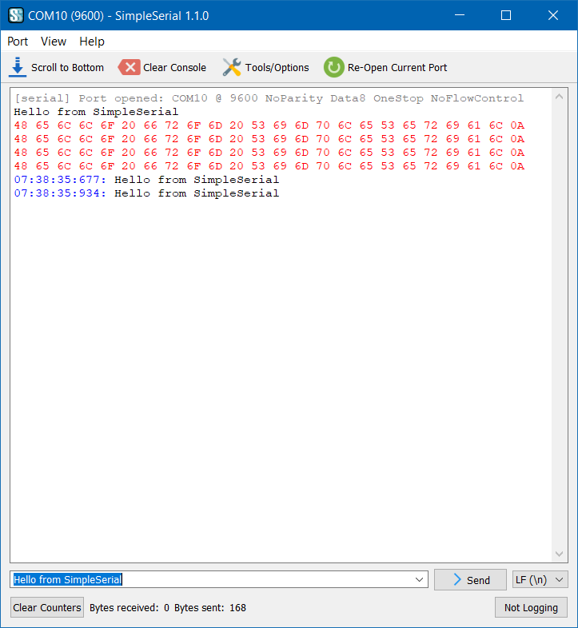

SimpleSerial
============

A simple serial (and TCP and UDP) terminal app
----------------------------------------------

2017-2024 Gideon van der Kolf, noedigcode@gmail.com

SimpleSerial is a cross-platform GUI terminal app for serial, TCP and UDP ports.



Features include:

- Open serial ports
- Host a TCP server
- Connect to a TCP server as a client
- Listen on a UDP port and send UDP messages
- Display sent and received data in ASCII or hex
- Display timestamps for sent and received data
- Escape sequences for sending hex data
- Log data to a file
- Preset macros for quickly sending different messages
- Timed messages at a fixed frequency
- Basic auto-reply functionality based on a received message
- Tested on Windows and Linux, probably works on other platforms as well where
  Qt runs


Requirements
------------

- Qt5
- Qt serialport (`libqt5serialport5` on Ubuntu)


Serial port permission on Linux
-------------------------------

On an Ubuntu based Linux system, the user has to be added to the `dialout` group
in order to access serial ports.

To see the groups to which a user belongs, use the `groups` command:
```
groups username
```
Where `username` must be replaced by the actual username.

To add a user to the `dialout` group, use the `usermod` command:
```
sudo usermod -a -G dialout username
```
Where `username` must be replaced by the actual username.

A reboot is required before this will take effect.


Building
--------

The Qt development packages are required:

- Qt5 development packages (`qtbase5-dev` on Ubuntu 21+, `qt5-default` on Ubuntu 20.04)
- Qt serialport (package `libqt5serialport5-dev` on Ubuntu 22.04+)

Open the simpleserial.pro file with QtCreator and build.

Or, on Linux, run the following from the command line:
```
mkdir build
cd build
qmake ../SimpleSerial.pro
make
```

